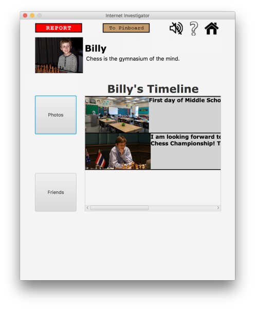
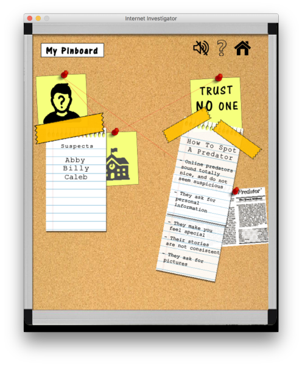
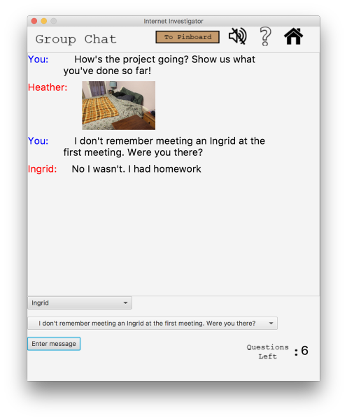

**Internet Investigator** is a desktop game built entirely from scratch, without the use of a game library. The project 
was **written entirely in Java** and **JavaFX**, the standard GUI library for Java SE. All code by Jake Goodman and 
Nathan Henry. All game art by Nathan Henry.

MIT Licence

The Game
========
Internet Investigator is a one-player detective game, in which the user attempts to **expose internet predators** 
disguised as kids on social media by solving a series of logic puzzles. In the game, you play as a young boy that just 
started middle school and got his first social media account. Without knowing anyone, you add many friends on social 
media in an attempt to make friends. However, your older brother warns that you should be careful of who you add on 
social media because there are many predators on social media disguised as kids. And then the game begins.

In each level, you are given a group of people and have reason to believe that someone in that group is not who they
say they are. You must figure out which person is an internet predator, and then report them! There are 6 levels in
total, and two level types: Profile levels and Chatbox levels.

Profile levels
---------------
Profile levels will require the user to look through social media profile pages. Each profile page has a bio section, 
a profile picture, a timeline, a a photos section. The user’s job is to look for discrepancies, while also searching 
for common signs of predators, as shown in the instructions. Once they think they've found the predator, they report
and proceed to the next level.

Chat levels
-----------
Chat levels take place in a group chat. One of the people in this chatroom is an online predator, though only your 
character. In these levels, you will get the chance to “interrogate” members of the chat by selecting questions to ask
from a question menu, given to you for each chat level. However, you will only get a certain number of questions to ask 
before the others become suspicious of you! You must report someone in the chat before your questions run out

Education Integration And Focus
-------------------------------
In the instructions to the game, there will be a section in which the user will **learn** the signs of an internet 
predator and some statistics regarding internet safety. The actual game will be putting the user’s knowledge to the 
test, while giving the user **realistic experience** with identifying internet predators. The focus of this game
surrounds **internet safety** and online predator awareness.
